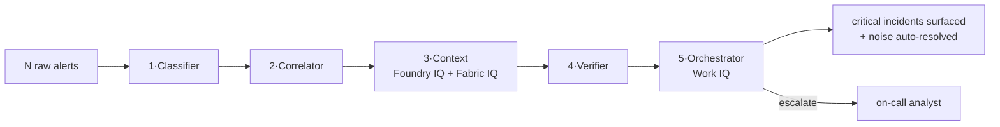

# SOC Alert Triage Agent

> A multi-agent reasoning system that finds the real attack hidden in a flood of
> security alerts — grounds every decision in cited runbooks, and never takes an
> impactful action without a human.

## What it does

A Security Operations Center (SOC) receives thousands of alerts a day. Almost all
are noise, and a real multi-stage intrusion can hide split across several "medium"
alerts on different systems. This agent automates **first-line triage**:

1. **Ingests** a batch of raw security alerts (any SIEM/EDR format).
2. **Classifies** each one (severity + MITRE ATT&CK technique) and flags false positives.
3. **Correlates** the suspicious ones into incidents by shared entity + time.
4. **Grounds** each incident in cited runbooks and weighs the affected asset's
   business criticality.
5. **Verifies** that the evidence supports the conclusion (anti-over-reaction).
6. **Decides**: auto-resolve the noise, or escalate a single explainable, cited
   incident report to a human analyst.

On the synthetic dataset it reconstructs full kill chains
(phishing → execution → credential theft → lateral movement → exfiltration) hidden
among dozens of benign alerts, and routes only the real incidents to a human.

## What it can do (today)

- Run **100% offline** with a deterministic engine (no cloud, no keys) — great for demos and CI.
- Run on a **real LLM** via **Azure AI Foundry** (tested with `gpt-4.1-mini`) by changing one `.env` variable — no agent-code changes.
- **Reconstruct multi-stage attacks** and rank them by business impact (a finance DB outranks a spare laptop).
- **Explain & cite** every verdict (runbook citations `RB-00x`) and **log every inter-agent call** (telemetry).
- **Evaluate itself** against a labeled ground truth (precision / recall / F1).
- **Accept real alerts** from any SIEM/EDR through a normalization layer — ready to connect (see below).
- Enforce a **human-in-the-loop safety boundary**: only reversible, low-risk outcomes are automated.

## How it works — the 5 agents

| # | Agent | Responsibility | Tool / IQ layer |
|---|-------|----------------|-----------------|
| 1 | **Classifier** | Severity + MITRE ATT&CK technique per alert, with a benign/false-positive flag | LLM (Foundry) / local rules |
| 2 | **Correlator** | Drops noise, clusters suspicious alerts into incidents by entity + time | Code (graph clustering) |
| 3 | **Context** | Retrieves cited runbooks + the affected asset's business criticality | **Foundry IQ + Fabric IQ** |
| 4 | **Verifier** | Confirms evidence supports the conclusion; scores confidence; flags FPs | LLM (Foundry) / local rules |
| 5 | **Orchestrator** | Computes priority, decides auto-resolve vs. escalate, writes the report | **Work IQ** (on-call analyst) |



Full diagram: **[docs/architecture.md](docs/architecture.md)**.

### Microsoft IQ integration
- **Foundry IQ** → grounded runbook retrieval; every verdict carries citations.
- **Fabric IQ** → business-asset criticality (drives the priority score).
- **Work IQ** → human-in-the-loop escalation to the on-call analyst.

### Pluggable backend (the key design)
Agents depend only on two interfaces (`ModelProvider`, `KnowledgeProvider`). A
factory picks the implementation from `AGENT_BACKEND`:

| Layer | `local` (default) | `foundry` |
|-------|-------------------|-----------|
| Reasoning | Deterministic rules | **Azure AI Foundry LLM** (e.g. gpt-4.1-mini) |
| Knowledge | Keyword index over `runbooks.md` | Foundry IQ knowledge base |
| Criticality | `asset_inventory.json` | Microsoft Fabric dataset |
| Human handoff | `oncall_queue.jsonl` | Microsoft 365 / Teams |

## Run it

```powershell
python -m venv .venv
.\.venv\Scripts\Activate.ps1          # macOS/Linux: source .venv/bin/activate
pip install -r requirements.txt
python main.py        # run the triage pipeline (local, instant)
python eval.py        # precision / recall / F1 vs ground truth
pytest                # tests
```

Generate a fresh dataset of any size (valid, with hidden attack chains):
```powershell
python scripts/generate_alerts.py --n 150 --chains 5 --seed 42
python scripts/rebuild_dataset.py     # re-labels ground truth + asset inventory
python eval.py
```

## Connect the real LLM (Azure AI Foundry)

Full step-by-step: **[docs/foundry_setup.md](docs/foundry_setup.md)**. In short:

```powershell
pip install -r requirements-foundry.txt
pip install openai azure-ai-inference
az login
# .env:
#   AGENT_BACKEND=foundry
#   AZURE_AI_PROJECT_ENDPOINT=https://<resource>.services.ai.azure.com/api/projects/<project>
#   AZURE_AI_MODEL_DEPLOYMENT=gpt-4.1-mini
python main.py
```

The same 5 agents now reason with the LLM — richer narratives, finer MITRE
techniques — with no code changes. (Each alert is one LLM call, so use a small
dataset for live demos.)

## Connect real alerts

The ingestion layer normalizes alerts from **any vendor** (Microsoft Sentinel,
Defender, Splunk, Elastic, syslog…) onto the internal schema, then runs the same
pipeline. It is built and ready — just point it at a real feed when available.

```powershell
# triage real alerts (any vendor field names) from a file or stdin:
python scripts/triage_stream.py --file data/sample_real_alerts.jsonl
type data\incoming.jsonl | python scripts/triage_stream.py
```

- `src/ingest.py` → `normalize_alert()` maps vendor fields to the schema and
  generates stable IDs (re-ingesting the same alert is idempotent).
- `scripts/triage_stream.py` → the production entry point (file or stdin).
- `data/sample_real_alerts.jsonl` → example alerts in mixed vendor formats.

For a real institutional deployment (SIEM connector, Foundry IQ, SOAR, hardening),
see **[docs/production_integration.md](docs/production_integration.md)**.

## Evaluation

`eval.py` scores the system against `data/ground_truth.json` and reports a
confusion matrix + precision / recall / F1. The local engine is **recall-first**
(tuned not to miss attacks): on clean data precision is near-perfect; on large,
messy real data precision drops while recall stays high — which is exactly why the
**Foundry LLM backend** exists.


## Repo layout

```
data/        synthetic alerts, runbooks, asset inventory, ground truth, sample real alerts
src/         models, config, data_loader, ingest, telemetry, pipeline
src/agents/  the 5 agents (classifier, correlator, context, verifier, orchestrator)
src/providers/  local + foundry backends behind one interface (factory selects)
src/tools/   scoring (severity x criticality), correlation (clustering)
scripts/     generate_alerts, rebuild_dataset, triage_stream
docs/        architecture, foundry_setup, production_integration, agent_prompts, test_plan, demo_video_script
tests/       pytest suite
main.py      run the pipeline      eval.py  score vs ground truth
```


