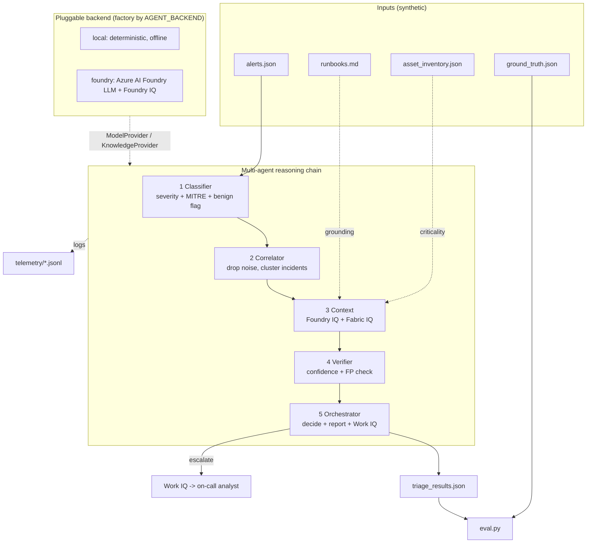

# Architecture — SOC Alert Triage Agent

Agents depend only on `ModelProvider` (reasoning) and `KnowledgeProvider`
(grounded retrieval). Swapping `AGENT_BACKEND` swaps the implementation with no
agent-code changes. Safety: auto-resolve only reversible low-risk outcomes; any
impactful action escalates to a human.
